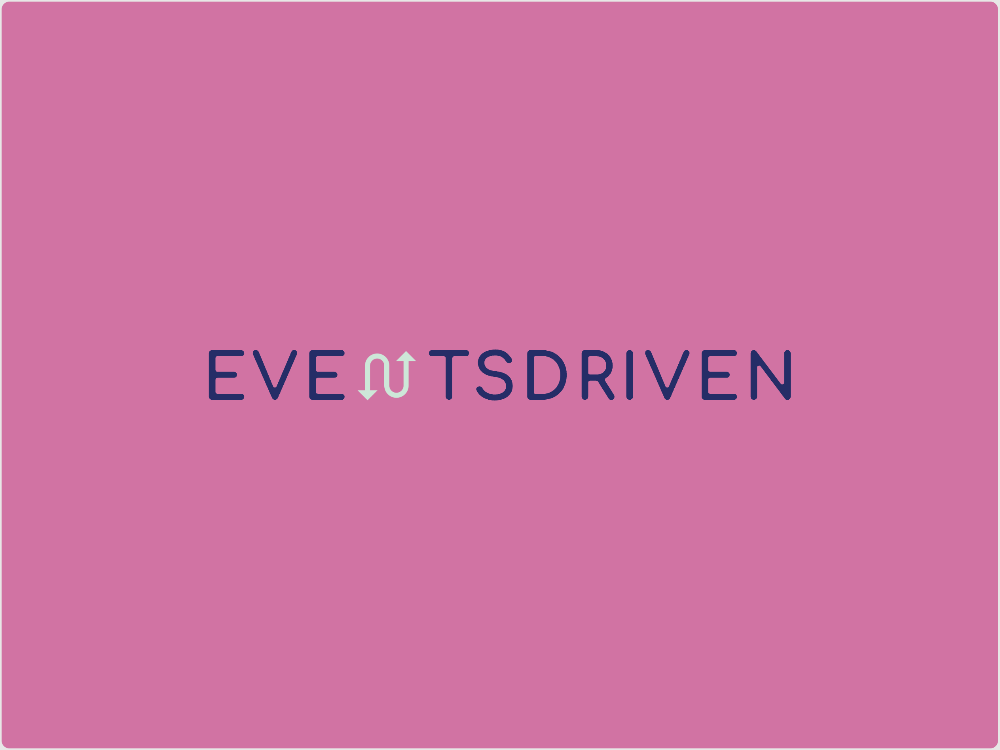

# Unitee.EventDriven

[https://github.com/uniteeio/Unitee.EventDriven](https://github.com/uniteeio/Unitee.EventDriven)



# Summary

Unitee.EventDriven is a wrapper arround technologies we use to publish and subscribe to Events. Currently we support
  * Publishing to Azure Service Bus topics for one to many communication (Unitee.EventDriven.AzureServiceBus)
  * Publishing to Azure Service Bus queues for one to one communication (Unitee.EventDriven.AzureServiceBus)
  * Publishing to Redis Stream (Unitee.EventDriven.RedisStream)
  * Subscribing to Azure Service Bus Subscription in Azure Functions
  * Subscribing to Azure Service Bus Subscription in hosted applications (via IHostedService)
  * Subscribing to Redis Stream in hosted applications (via IHostedService)

# Documentation

The complete documentation can be found on the [wiki](https://github.com/uniteeio/Unitee.EventDriven/wiki)

# Install

```
dotnet add package Unitee.EventDriven.AzureServiceBus
```

```
dotnet add package Unitee.EventDriven.RedisStream
```


